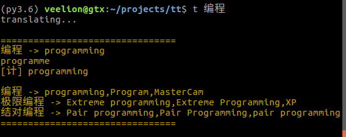
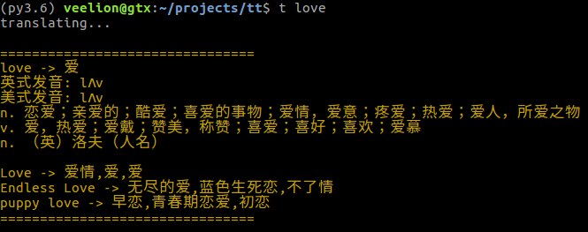

# tt [TerminalTranslator]
TerminalTranslator is a command line translating tool using Youdao API.
用Python写的一个命令行下的翻译小工具，使用的是有道翻译的API。
支持中英互译，速度快，方便命令行下使用。

# Install

```bash
sudo pip install terminaltranslator
```
安装后会在/usr/local/bin 下面生成两个快捷命令t和tt。

# 效果

请看下图：





